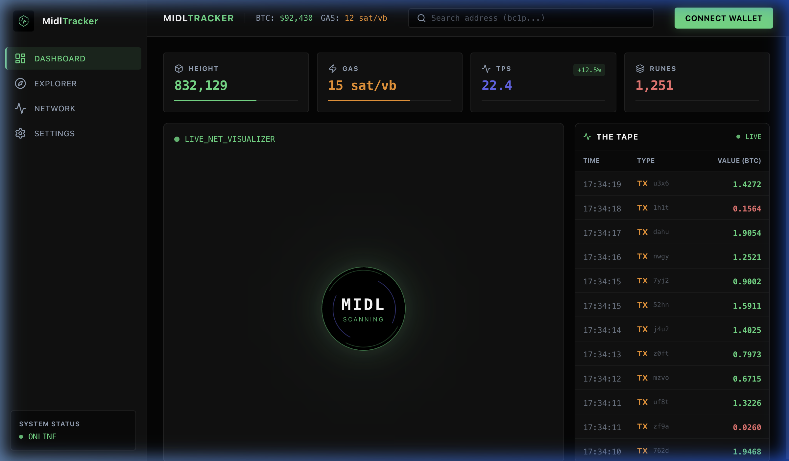
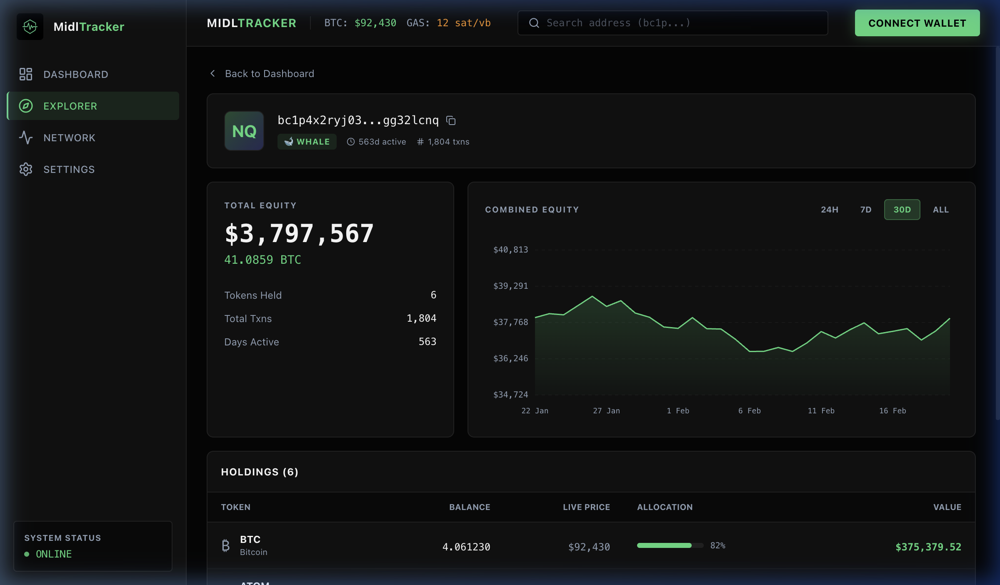

# MidlTracker — Bitcoin L2 Explorer

> Real-time activity tracker for the [Midl](https://midl.xyz) Bitcoin Layer 2 network. Built for the Vibe Coding Competition.



## Features

- **Live Dashboard** — Real-time block height, gas fees, TPS, and active Runes
- **Network Visualizer** — Animated MIDL orb with live transaction pulse
- **The Tape** — Streaming transaction table with type badges and BTC values
- **Address Explorer** — Search any BTC address to view equity, charts, and token holdings
- **Wallet Connect** — Xverse wallet integration via sats-connect



## Tech Stack

| Layer | Tech |
|-------|------|
| Framework | React 19 + Vite 7 |
| Styling | Tailwind CSS 3 |
| Animations | Framer Motion |
| Wallet | sats-connect (Xverse) |
| Charts | Canvas API (zero deps) |
| Icons | Lucide React |

## Getting Started

```bash
# Install dependencies
npm install

# Start dev server
npm run dev
```

Open [http://localhost:5173](http://localhost:5173)

## Project Structure

```
src/
├── components/
│   ├── dashboard/     # StatCard, LiveFeed
│   ├── explorer/      # AddressProfile (chart + holdings)
│   ├── layout/        # AppShell (sidebar, header, search)
│   └── visualizer/    # PulseOrb
├── hooks/
│   └── useWallet.js   # Xverse wallet connection
├── services/
│   ├── midl.js        # Network data (simulated)
│   └── addressService.js  # Address lookup (mock)
└── App.jsx            # View routing
```

## License

MIT
